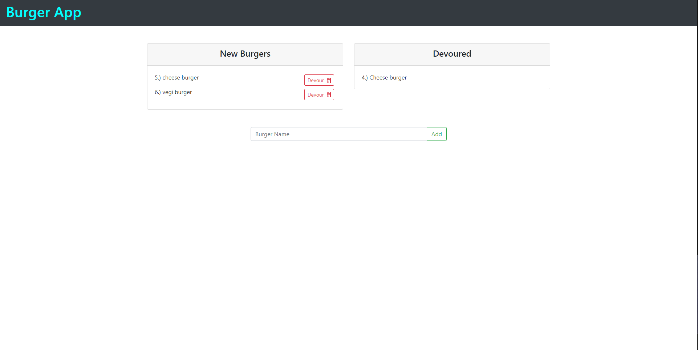

# Burger App

* [How it works](#work)
* [Install](#install)
* [Credits](#credits)
* [License](#license)
# How it works 
Allowing users to enter and burger and eat it 
## Install
clone the repo or just use the browser 
## Instructions
Enter the name of your burger it will then be moved to the left and the user will have the option to devour the burger moving it to the right side of the page 
## Credits
Elijah Davis
## License 
N/A
## Reporting issues and making contributions 
Makes issues on the git repo
# Contact
* Github :ElijahIG
* E-mail :elijahgdavis1999@gmail.com

